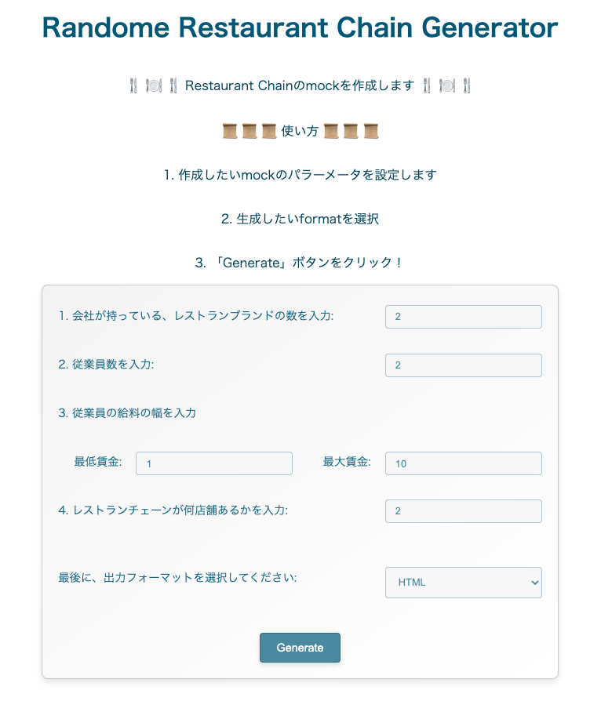

# RestaurantChainMockup_RecursionCS

# 概要

RecursionCS バックエンドプロジェクトの課題です

Restaurant chain のモックアップを作成し、各種ダウンロード or HTMLで表示します

# 使い方

## 準備

まず以下のコマンドでサーバーをたてる

```shell
cd app
php -S localhost:3000
```

その後、http://localhost:3000にアクセスする

## 使用方法

1. 作成したいmockのパラメータを設定する

2. 生成したいformatを選択する

3. 「Generate」ボタンをクリックして、Let's Generate!



